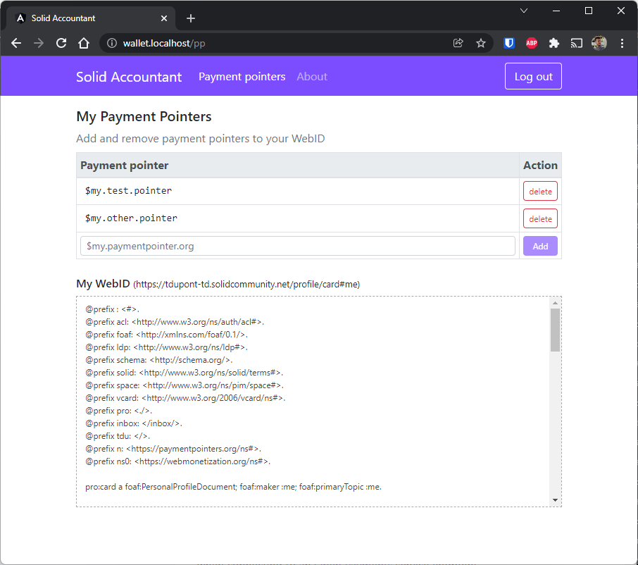

# Solid Accountant

The Accountant application is an example of a simple app that allows you to authenticate with your solid pod and store [payment pointer](https://paymentpointers.org/) information in it.

--8<-- "includes/abbreviations.md"