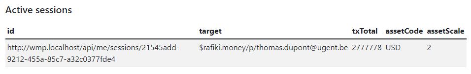

# Demo scenario

This is a step-by-step guide through the demo scenario.

## 1. Setup

As explained in the [introduction](/solid-web-monetization/demo/intro), you will need docker and git installed on you local pc.

### 1.1 Create a content owner wallet

The content creator will need a wallet account. For that we are going to create an account on [Rafiki Money](https://rafiki.money/).

* Click SINGUP
* Enter an email and a password (the email will be part of the payment pointer address)
* Login with the new account
* On the overview page you will see two important parts. The Payment Pointer, which you can copy and store for the next step.
* The Monetization box, which you will see increase later in the demonstrator.


### 1.2 Set environment variables

We will need to enter the Rafiki payment pointer from the previous step as an environment variable in the microstore service, so that it can be added in the appropriate meta tag of the HTML.

* Clone the repository `git clone https://github.com/KNowledgeOnWebScale/solid-web-monetization.git .`
* `cd solid-web-monetization`
* Edit the `docker-compose.yml` file in the root folder.

```yaml title="docker-compose.yml" linenums="27" hl_lines="10"
  store:
    image: ghcr.io/knowledgeonwebscale/solid-web-monetization/microstore:latest
    pull_policy: always
    container_name: store
    labels:
      - "traefik.enable=true"
      - "traefik.http.routers.store.rule=Host(`store.localhost`)"
      - "traefik.http.routers.store.entrypoints=web"
    environment:
      - "PAYMENT_POINTER=$$rafiki.money/p/your@email.com" # (1)
      - "CONFIG_VARS=PAYMENT_POINTER"
      - "CONFIG_FILE_PATH=/app/assets"
      - "CONFIG_FILE_NAME=config.json"
```

1. :warning: Don't forget to escape the `$` sign by typing `$$`!

### 1.4 Register WMP as client (optional)

**This step is optional** and only needed if you will run the components in the `docker-compose.yml` file on other endpoints/ports etc. If so, you will be required to first follow the steps in the [practical section](/solid-web-monetization/wmp/practical#client-registration) of the WMP.

The resulting `client_id` and `client_secret` can be added in the `docker-compose.yml` file here:

```yaml title="docker-compose.yml" linenums="41" hl_lines="16 17"
  wmp:
    image: ghcr.io/knowledgeonwebscale/solid-web-monetization/wmp:latest
    pull_policy: always
    container_name: wmp
    expose:
      - "8080"
    labels:
      - "traefik.enable=true"
      - "traefik.http.routers.wmp.rule=Host(`wmp.localhost`)"
      - "traefik.http.routers.wmp.entrypoints=web"
    environment:
      - "BASE_URI=http://wmp.localhost"
      - "MONGO_CONNECTION_STRING=mongodb://mongodb:27017"
      - "REDIRECT_URI=http://wmp.localhost/auth/cb"
      - "REDIRECT_URI_POST_LOGOUT=http://wmp.localhost/auth/logout/cb"
      - "CLIENT_ID=79e3648fc184f70306e4072f3a856bb1"
      - "CLIENT_SECRET=2ba10ec24a3cb231ee39781bc3882d66"
```

### 1.3 Start services

Now we can finally start all services!

```bash
cd solid-web-monetization # cd into the root repository folder
docker compose up -d      # start all services in docker-compose.yml file in detached mode
```
This will start all demo components on your pc.

Component | URL | Description
----------|-----|------------
[Accountant](/solid-web-monetization/accountant) | http://wallet.localhost | Allows you to edit your payment pointers stored in your WebID (on your Solid pod).
[Web Monetization Provider](/solid-web-monetization/wmp) | http://wmp.localhost | Allows you to register the WMP in your WebID (on your Solid pod) and setup a subscription to pay the WMP.
[Microstore](/solid-web-monetization/microstore) | http://store.localhost | Website of the content creator that have unlockable monetized content for users logged in with WebID.
Docs | http://docs.localhost | These docs are also hosted locally on your pc now.


## 2. Create your Solid Pod

For this demo you will need your own Solid pod. Since this demonstrator is hardwired to https://solidcommunity.net, that is where we will register our pod.

 * Click `Register to get a Pod` on the top right of [the page](https://solidcommunity.net).
 * Fill out the form and press `Register`.

You should now be able to login, and see your WebID URI, it will be of the form `https://<username>.solidcommunity.net/profile/card#me`

## 3. Add your payment pointer (accountant app)

Normally you would have a wallet account somewhere with a [payment pointer](https://paymentpointers.org) address. To be able to pay for monetized Solid apps, you will now register that payment pointer in your WebID. We will just add an example paymnet pointer address. Internally the WMP will be funded through other payments. (More in [step 4](#4-subscribe-to-the-wmp-web-monetization-provider-app))

!!! important
    The part where the user pays the WMP from his/her wallet is still mocked. It seemed impossible to do a pure browser based STREAM payment from a payment pointer at this stage, because of the [limitations outlined in the specification](/solid-web-monetization/spec.html#goals).

Now we will use the Accountant application to add a payment pointer to your Solid pod.

### 3.1 Login

* Browse to http://wallet.localhost
* Press `Login` on the top right.
* Pick the solidcommynity.net box  
  
* Follow the redirect and log in there with your newly created pod account

### 3.2 Add payment pointers

Once back in the application, open the `Payment pointers` page.
 
Now enter an example payment pointer `$example.my.pointer` in the form and click `Add`.


It will be listed once added  .


You can see the entry in your WebID profile output too:

```turtle
@prefix : <#>.
@prefix foaf: <http://xmlns.com/foaf/0.1/>.
@prefix schema: <http://schema.org/>.
@prefix n: <https://paymentpointers.org/ns#>.

:me
    a schema:Person, foaf:Person;
    n:hasPaymentPointer :me-paymentpointer-1;

:me-paymentpointer-1
    a n:InterledgerPaymentPointer; 
    n:paymentPointerValue "$example.my.pointer".

```

If you wish you can add multiple pointers, this will allow you to choose between them in your WMP subscription later.

## 4. Subscribe to the WMP

We will now subscribe with the WMP application. The idea is that we subscribe and pay a monthly fee for the service. The WMP on their part will send micropayments to any web-monetized content we browse, while logged in with our WebID.

!!! warning
    This demonstrator works over an [interledger testnet](https://interledger.org/developer-tools/get-started/set-up/). This means all funds are fake and nothing of monetary value is being sent right now.

### 4.1 Login

* Browse to https://wmp.localhost
* Click `Login with WebID` on the top right.
* You will probably not notice the redirect, since you are still logged in from before. If not, please login now.

### 4.2 Subscribe

Open the `Manage` page. Your registered payment pointers are now read from your WebID profile document. Select one of your registered payment pointer and click `Subscribe with WebID`.


Two things now happen:

* This WMP is written to your WebID Profile for later use.
* A [Mandate](https://docs.openpayments.dev/mandates) is set up following the [Open Payments](https://openpayments.dev/) specification draft. This allows the WMP to claim [Charges](https://docs.openpayments.dev/charges) from your chosen payment pointer (and the wallet behind it).

!!! info
    Since no wallets were found that already implement the [Open Payments](https://openpayments.dev/) specification draft, this part is mocked. The WMP will instead use generated accounts on [ILPv4 Testnet Faucet](https://faucet.ilpv4.dev/), to generate temporary accounts with fake funds, and transfer money over the ILP testnet from there.

The page now shows detail on the subscription.


You can see the entry in your WebID profile output too:

```turtle
@prefix : <#>.
@prefix foaf: <http://xmlns.com/foaf/0.1/>.
@prefix schema: <http://schema.org/>.
@prefix ns0: <https://webmonetization.org/ns#>.

:me
    a schema:Person, foaf:Person;
    ns0:hasProvider :me-webmonetization-provider;

:me-webmonetization-provider 
    a ns0:Provider; 
    ns0:apiUrl "http://wmp.localhost".

```


## 5. Browse to the microstore app

The only thing left to do now is to browse to the [Microstore application](/solid-web-monetization/microstore/) to view some monetized content.

* Browse to http://store.localhost
* Open the subpages while logged out.
    * Paywall: This example has a large paywall in front of the content.
    * Mixed content: This example has some locked premium content in between the viewable images.

### 5.1 Login

Click `Login with WebID` on the top right.

### 5.2 Open subpage paywall

Open the `Paywall` page. Now that you are logged in, the button to unlock the content is shown.

* Click `Unlock through Web Monetization`.
* The paywall is hidden.
* The state of the counter up top goes from `pending` to `0`
* Once the first payment goes through, the counter is updated.
* Now open a new screen and browse to https://rafiki.money/login
* Log in with the content creator account from [step 1.2](#12-set-environment-variables)
* Watch as the Monetization box gets updated, while the paywall page is open.  


### 5.3 Open subpage mixed content

Open the `Mixed content` page. Now that you are logged in, this page automatically show the premium content (by hiding the locked banners).

* The state of the counter up top goes from `pending` to `0`
* Once the first payment goes through, the counter is updated.
* Now open a new screen and browse to https://rafiki.money/login
* Log in with the content creator account from [step 1.2](#12-set-environment-variables)
* Watch as the Monetization box gets updated, while the mixed content page is open.  


### 5.4 Active session in WMP

In the WMP you can also see that a session is active.

* Browse to http://wmp.localhost
* Login if not logged in
* Open the `Manage` page
* Scroll to the end to the `Active sessions` section
  


_This concludes the demonstrator scenario._

--8<-- "includes/abbreviations.md"