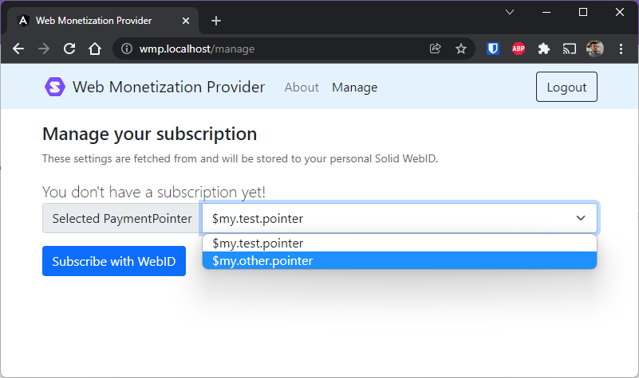

# Solid Web Monetization Provider

The Solid Web Monetization Provider is an example of an intermediate party that performs micropayments to [payment pointers](https://paymentpointers.org) on behalf of a user. That user trusts the WMP and has an active subscription with it.

--8<-- "includes/abbreviations.md"